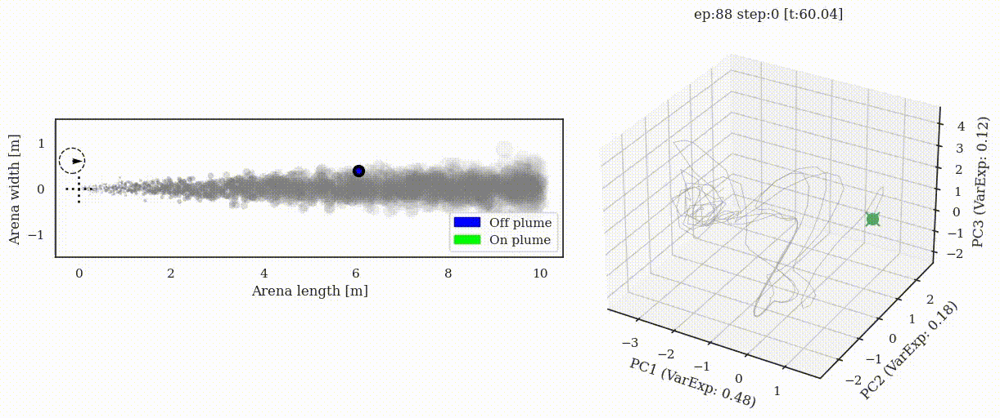

# Online supplement for manuscript
[Preprint: "Emergent behavior and neural dynamics in artificial agents tracking turbulent plumes"](https://arxiv.org/abs/2109.12434)
Authors: Satpreet H. Singh, Floris van Breugel, Rajesh P. N. Rao, Bingni Wen Brunton
Contact: satsingh@uw.edu 


BibTeX:
```
@misc{singh2021emergent,
      title={Emergent behavior and neural dynamics in artificial agents tracking turbulent plumes}, 
      author={Satpreet H. Singh and Floris van Breugel and Rajesh P. N. Rao and Bingni Wen Brunton},
      year={2021},
      eprint={2109.12434},
      archivePrefix={arXiv},
      primaryClass={q-bio.NC}
}
```

[#tweeprint](https://twitter.com/tweetsatpreet/status/1442974225032093698) on this paper: 
<blockquote class="twitter-tweet"><p lang="en" dir="ltr">1/n Excited to share our new preprint where we study turbulent plume tracking using deep reinforcement learning (DRL) trained RNN *agents* and find many intriguing similarities with flying insects. w/ <a href="https://twitter.com/FlorisBreugel?ref_src=twsrc%5Etfw">@FlorisBreugel</a> <a href="https://twitter.com/RajeshPNRao?ref_src=twsrc%5Etfw">@RajeshPNRao</a> <a href="https://twitter.com/bingbrunton?ref_src=twsrc%5Etfw">@bingbrunton</a>; <br> <a href="https://twitter.com/hashtag/tweeprint?src=hash&amp;ref_src=twsrc%5Etfw">#tweeprint</a> <a href="https://twitter.com/Flypapers?ref_src=twsrc%5Etfw">@flypapers</a> <a href="https://twitter.com/hashtag/Drosophila?src=hash&amp;ref_src=twsrc%5Etfw">#Drosophila</a> <a href="https://t.co/PdVKxbP0hs">pic.twitter.com/PdVKxbP0hs</a></p>&mdash; Satpreet Singh (@tweetsatpreet) <a href="https://twitter.com/tweetsatpreet/status/1442974225032093698?ref_src=twsrc%5Etfw">September 28, 2021</a></blockquote> 

Invited Talk at [Montreal AI-Neuroscience Conference 2021 (Nov 2021)](https://twitter.com/tweetsatpreet/status/1462948984545169408) on this work:
<blockquote class="twitter-tweet"><p lang="en" dir="ltr">Check out <a href="https://twitter.com/bingbrunton?ref_src=twsrc%5Etfw">@bingbrunton</a>&#39;s upcoming talk at MAIN 2021 on our recently released preprint:<a href="https://t.co/7fkIuXiRkt">https://t.co/7fkIuXiRkt</a> <a href="https://t.co/eOkylFSltP">https://t.co/eOkylFSltP</a></p>&mdash; Satpreet Singh (@tweetsatpreet) <a href="https://twitter.com/tweetsatpreet/status/1462948984545169408?ref_src=twsrc%5Etfw">November 23, 2021</a></blockquote> <script async src="https://platform.twitter.com/widgets.js" charset="utf-8"></script>


## Animations: Trajectory + neural state
All animations, including failure cases and all 5 Vanilla RNN (VRNN) seeds:
* By seed:
  * [VRNN 1 (Seed: 2760377)](VRNN1.md) 
  * [VRNN 2 (Seed: 3199993)](VRNN2.md) 
  * [VRNN 3 (Seed: 3307e9)](VRNN3.md) + [Eigenvalue timecourse example](VRNN3-eigen.md)
  * [VRNN 4 (Seed: 541058)](VRNN4.md) 
  * [VRNN 5 (Seed: 9781ba)](VRNN5.md) 

* By plume configuration:
  * [Constant plume](constant.md)
  * [Switch-once plume](switch-once.md)
  * [Switch-many plume](switch-many.md)
  * [Sparse plume](sparse.md)


### Example: VRNN Agent 3 (Seed: 3307e9)



## Code, Data & Reproducibility

Code to reproduce this manuscript can be found in the subfolder ```code/```

Data (agent model/network files, model evaluation data) can be downloaded from Figshare: https://doi.org/10.6084/m9.figshare.16879539.v1 (approx. 9GB)

### Helpful Documentation:
* [Prerequisites](0_plume_prereqs.md): Summary of packages needed, data organization, simulation data generation and configuration

* [Figure/Report generation](1_plume_report.md): Instructions/Scripts to generate the images used in the manuscript from agent evaluation data

* [Agent evaluation](2_plume_eval.md): Instructions/Scripts to (re)generate agent evaluation data i.e. the "behavioral assays". Only required if not using the downloaded data

* [Agent Training](3_plume_train.md): Instructions/Scripts to train agents from scratch

* [Animations](4_plume_videos.md): Some commands for generating animations

Note: All development was done on an Ubuntu Linux v20.04 workstation with Intel Core i9-9940X CPU and a TITAN RTX GPU.

Each seed takes about 16 hours to train and evaluate, with MLP and RNN models using 1 and 4 cores in parallel respectively.
