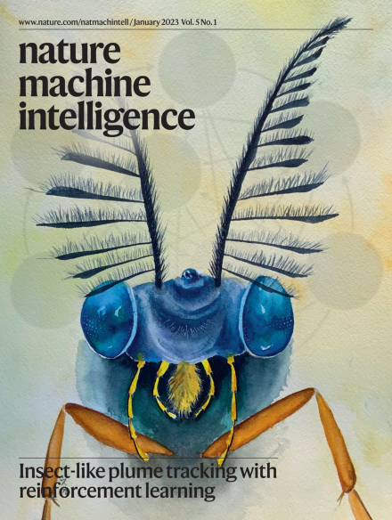

# Online supplement for published manuscript
[Emergent behaviour and neural dynamics in artificial agents tracking odour plumes (Nature Machine Intelligence. 2023 Jan)](https://www.nature.com/articles/s42256-022-00599-w)
Authors: Satpreet H. Singh, Floris van Breugel, Rajesh P. N. Rao, Bingni Wen Brunton
Contact: satsingh@uw.edu OR satpreetsingh@gmail.com

BibTeX:
```
@article{singh2023emergent,
  title={Emergent behaviour and neural dynamics in artificial agents tracking odour plumes},
  author={Singh, Satpreet H and van Breugel, Floris and Rao, Rajesh PN and Brunton, Bingni W},
  journal={Nature Machine Intelligence},
  volume={5},
  number={1},
  pages={58--70},
  year={2023},
  publisher={Nature Publishing Group UK London}
}
```




## Animations: Trajectory + neural state
All animations, including failure cases and all 5 Vanilla RNN (VRNN) seeds:
* By seed:
  * [VRNN 1 (Seed: 2760377)](VRNN1.md) 
  * [VRNN 2 (Seed: 3199993)](VRNN2.md) 
  * [VRNN 3 (Seed: 3307e9)](VRNN3.md) + [Eigenvalue timecourse example](VRNN3-eigen.md)
  * [VRNN 4 (Seed: 541058)](VRNN4.md) 
  * [VRNN 5 (Seed: 9781ba)](VRNN5.md) 

* By plume configuration:
  * [Constant plume](constant.md)
  * [Switch-once plume](switch-once.md)
  * [Switch-many plume](switch-many.md)
  * [Sparse plume](sparse.md)


### Example: VRNN Agent 3 (Seed: 3307e9)


## Code, Data & Reproducibility

Code to reproduce this manuscript can be found in the subfolder ```code/```

Data (agent model/network files, model evaluation data) can be downloaded from Figshare: https://doi.org/10.6084/m9.figshare.16879539.v1 (approx. 9GB)

### Helpful Documentation:
* [Prerequisites](0_plume_prereqs.md): Summary of packages needed, data organization, simulation data generation and configuration

* [Figure/Report generation](1_plume_report.md): Instructions/Scripts to generate the images used in the manuscript from agent evaluation data

* [Agent evaluation](2_plume_eval.md): Instructions/Scripts to (re)generate agent evaluation data i.e. the "behavioral assays". Only required if not using the downloaded data

* [Agent Training](3_plume_train.md): Instructions/Scripts to train agents from scratch

* [Animations](4_plume_videos.md): Some commands for generating animations

System requirements: 
* All development and testing was done on an **Ubuntu Linux v20.04 workstation with Intel Core i9-9940X CPU and a TITAN RTX GPU**.
* To reproduce manuscript figures, you need to only do the [Prerequisites](0_plume_prereqs.md) and [Figure/Report generation](1_plume_report.md) steps; this can be done on a _relatively_ lightweight Linux/POSIX computer/notebook as long as you have the space to download the data and install all prerequisite software (~10GB together). Expected install/run time after data (~9GB) has been downloaded and extracted is about 2-4 hours.
* (For full training) Each seed takes about 16 hours to train and evaluate, with MLP and RNN models using 1 and 4 CPU cores in parallel respectively. RNN training was done using with GPU acceleration. Be sure to see additional notes in [Agent Training](3_plume_train.md).

## Additional media
[#tweeprint](https://twitter.com/tweetsatpreet/status/1442974225032093698) on this paper: 
<blockquote class="twitter-tweet"><p lang="en" dir="ltr">1/n Excited to share our new preprint where we study turbulent plume tracking using deep reinforcement learning (DRL) trained RNN *agents* and find many intriguing similarities with flying insects. w/ <a href="https://twitter.com/FlorisBreugel?ref_src=twsrc%5Etfw">@FlorisBreugel</a> <a href="https://twitter.com/RajeshPNRao?ref_src=twsrc%5Etfw">@RajeshPNRao</a> <a href="https://twitter.com/bingbrunton?ref_src=twsrc%5Etfw">@bingbrunton</a>; <br> <a href="https://twitter.com/hashtag/tweeprint?src=hash&amp;ref_src=twsrc%5Etfw">#tweeprint</a> <a href="https://twitter.com/Flypapers?ref_src=twsrc%5Etfw">@flypapers</a> <a href="https://twitter.com/hashtag/Drosophila?src=hash&amp;ref_src=twsrc%5Etfw">#Drosophila</a> <a href="https://t.co/PdVKxbP0hs">pic.twitter.com/PdVKxbP0hs</a></p>&mdash; Satpreet Singh (@tweetsatpreet) <a href="https://twitter.com/tweetsatpreet/status/1442974225032093698?ref_src=twsrc%5Etfw">September 28, 2021</a></blockquote> 

Invited Talk at [Montreal AI-Neuroscience Conference 2021 (Nov 2021)](https://twitter.com/tweetsatpreet/status/1462948984545169408) on this work (Direct [Youtube link](https://www.youtube.com/watch?v=uaLRWADUXb8)):
<blockquote class="twitter-tweet"><p lang="en" dir="ltr">Check out <a href="https://twitter.com/bingbrunton?ref_src=twsrc%5Etfw">@bingbrunton</a>&#39;s upcoming talk at MAIN 2021 on our recently released preprint:<a href="https://t.co/7fkIuXiRkt">https://t.co/7fkIuXiRkt</a> <a href="https://t.co/eOkylFSltP">https://t.co/eOkylFSltP</a></p>&mdash; Satpreet Singh (@tweetsatpreet) <a href="https://twitter.com/tweetsatpreet/status/1462948984545169408?ref_src=twsrc%5Etfw">November 23, 2021</a></blockquote> 

Also presented at:
* [RLDM 2022](https://rldm.org)
* [CoSyNe 2022](https://www.cosyne.org/poster-session-3)
* [NAISys 2020](https://meetings.cshl.edu/abstracts.aspx?meet=naisys&year=20) 
* [IROS 2020 Robot Inspired Biology Workshop](http://gravishlab.ucsd.edu/iros2020/)
* [ALIFE Conference 2020](https://direct.mit.edu/isal/proceedings/isal2020/32/750/98465) 

[Preprint: "Emergent behavior and neural dynamics in artificial agents tracking turbulent plumes"](https://arxiv.org/abs/2109.12434)

## FAQs/Clarifications
* The statement in the paper "we did not find any fixed points in our RNNs" assumes that the FP analysis was done at points on the "operating manifold" (i.e. the approximate manifold defined by neural activity from many agent trajectories under diverse initial conditions.) This seems to be a standard assumption in the FP analysis literature. Otherwise, there are fixed points to be found in any high-dimensional trained RNN that are well outside it's "operating manifold".

