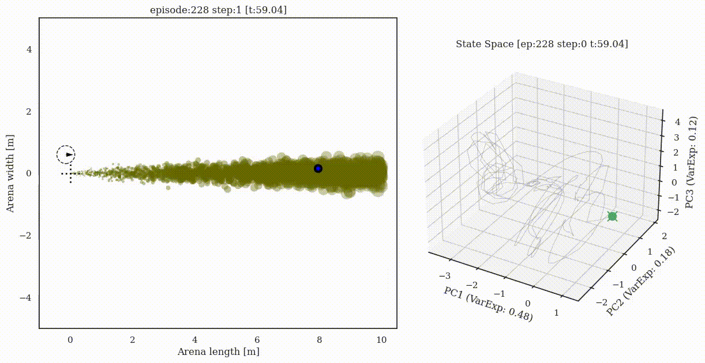
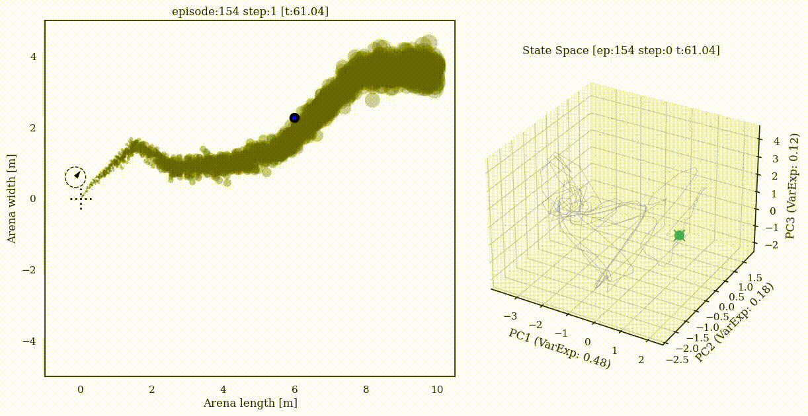
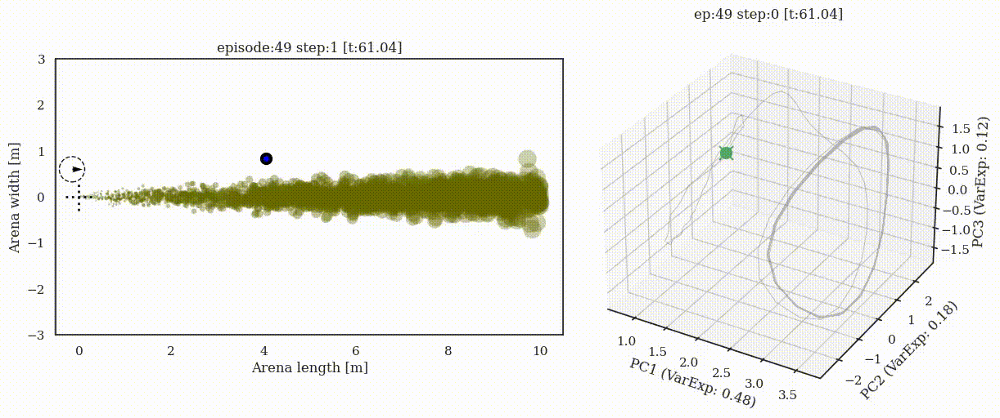
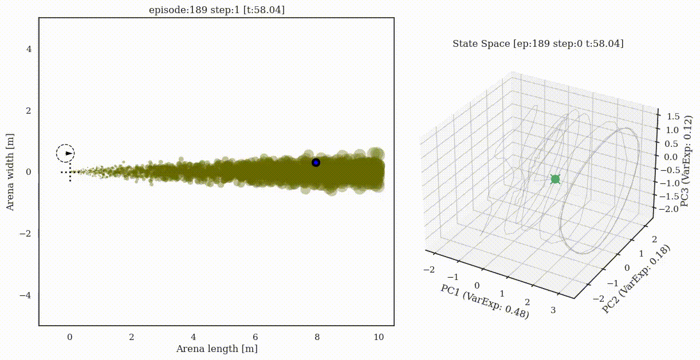
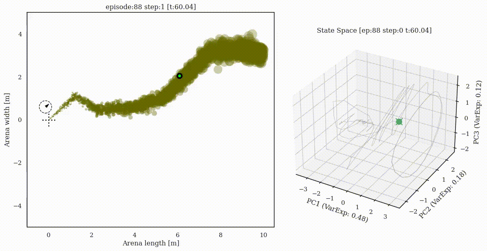

# Supplementary material for preprint

## Animations: Trajectory + Neural state

### Constant plume (Success)

### Switch-once plume (Success)

### Switch-many plume (Success)

### Constant plume (Failure)

### Switch-once plume (Failure)

### Switch-many plume (Failure)

## Animations: Eigenvalue timecourse 

