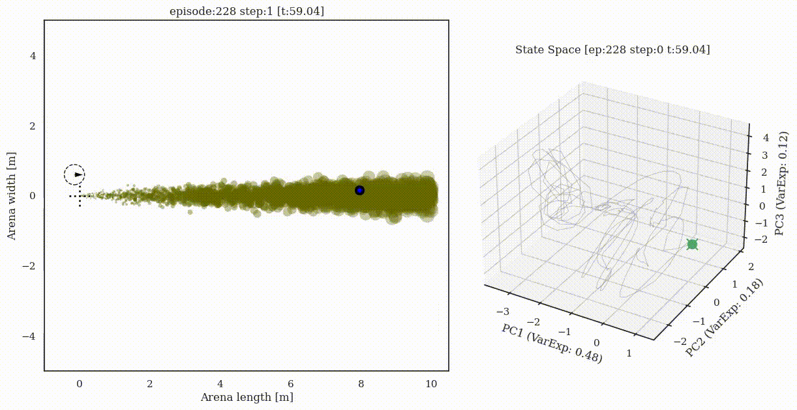
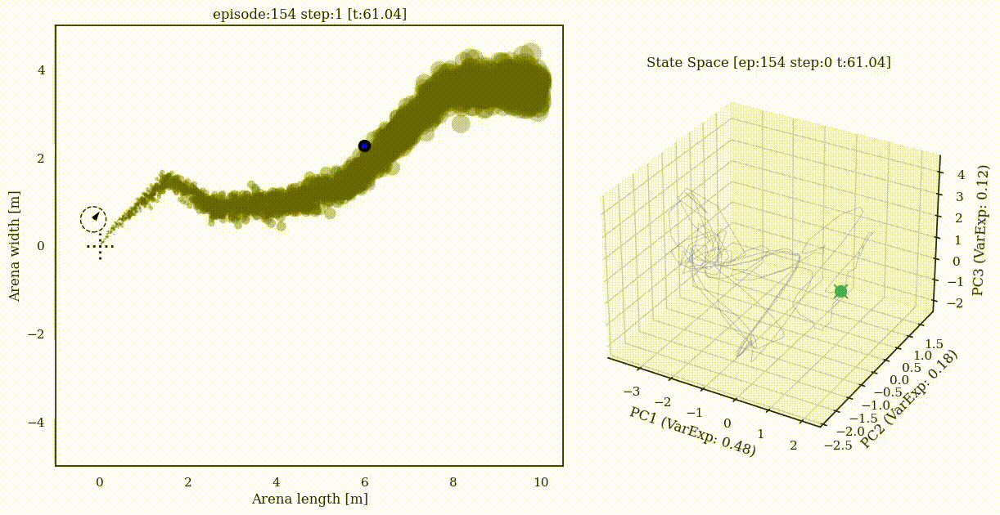
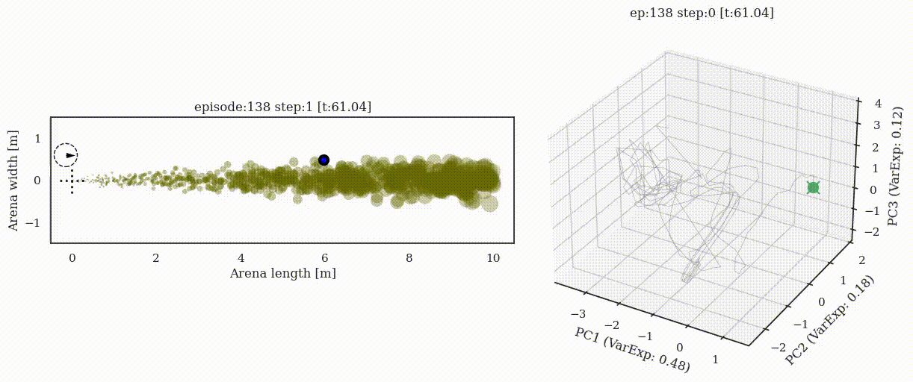

# Supplementary material for preprint

"Emergent behavior and neural dynamics in artificial agents tracking turbulent plumes"
Satpreet Harcharan Singh, Floris van Breugel, Rajesh P. N. Rao, Bingni Wen Brunton
* Preprint URL: https://arxiv.org/abs/2109.12434
* Tweeprint/Summary: https://twitter.com/tweetsatpreet/status/1442974225032093698

BibTeX:
```
@article{singh2021emergent,
  title={Emergent behavior and neural dynamics in artificial agents tracking turbulent plumes},
  author={Singh, Satpreet H and van Breugel, Floris and Rao, Rajesh PN and Brunton, Bingni W},
  journal={arXiv preprint arXiv:2109.12434},
  year={2021}
}
```

## Animations: Trajectory + neural state


All animations, including failure cases and all 5 Vanilla RNN (VRNN) seeds:
* By seed:
  * [VRNN 1 (Seed: 2760377)](VRNN1.md) 
  * [VRNN 2 (Seed: 3199993)](VRNN2.md) 
  * [VRNN 3 (Seed: 3307e9)](VRNN3.md) + [Eigenvalue timecourse example](VRNN3-eigen.md)
  * [VRNN 4 (Seed: 541058)](VRNN4.md) 
  * [VRNN 5 (Seed: 9781ba)](VRNN5.md) 

* By plume configuration:
  * [Constant plume](constant.md)
  * [Switch-once plume](switch-once.md)
  * [Switch-many plume](switch-many.md)
  * [Sparse plume](sparse.md)


### VRNN Agent 3 (Seed: 3307e9)
#### Constant plume (Success)


#### Switch-once plume (Success)


#### Switch-many plume (Success)


### Sparse plume (Success)

