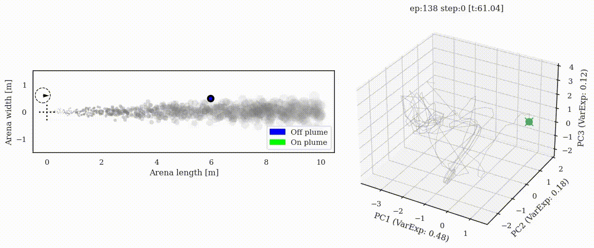

# Supplementary material for preprint

## Sec 4.1 Animations: Trajectory + neural state

All animations, including failure cases and all 5 VRNN seeds:
* By seed:
  * [VRNN 1 (Seed: 2760377)](VRNN1.md) 
  * [VRNN 2 (Seed: 3199993)](VRNN2.md) 
  * [VRNN 3 (Seed: 3307e9)](VRNN3.md) + [Eigenvalue timecourse example](VRNN3-eigen.md)
  * [VRNN 4 (Seed: 541058)](VRNN4.md) 
  * [VRNN 5 (Seed: 9781ba)](VRNN5.md) 

### VRNN Agent 3 (Seed: 3307e9)
#### Constant plume (Success)

#### Switch-once plume (Success)

#### Switch-many plume (Success)

### Sparse plume (Success)

